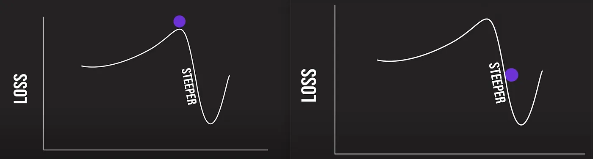

# Introduction

The purpose of this model is to predict the outcome of a standard League of Legends(LoL) ranked match based on the first ten minutes of the match. I will be 
using this <a href="https://www.kaggle.com/datasets/bobbyscience/league-of-legends-diamond-ranked-games-10-min">dataset</a>, from Kaggle by Yi Lan Ma, to predict the outcomes of a ranked LoL match based solely off the first 10 minutes of the match.

## Let's Get Familiar with LoL

### What is League of Legends?

League of Legends(LoL) is a 5v5, player vs player, MOBA game. If you don't know what that means...great! It doesn't matter for the purposes of this model! At it's core, LoL is a game with two teams(Blue and Red) of 5, with each player piloting a unique champion, battling it out to capture the enemy's base (aka Destroy the Nexus).


So what are the things a team needs in order to win?

### Objectives

Objectives are are structures(towers, inhibitors, and Nexus) and monsters(dragons and Herald) that a team must take in order to progress towards victory. 


There are 3 paths/lanes a team can take towards the opponent's base. However, each lane consists of 2 turrets, an inhibitor turret, and an inhibitor preventing a team's advance towards the opponent's base; the Nexus itself also has 2 turrets for self-defense (Refer to Visual 1.1 for reference). Long story short, the more Objectives a team captures, the closer they are to the Nexus. If the enemy Nexus is destroyed, then the team that destroyed it is the winner of the match. Easy right? Oh, no. The game is a lot more complicated than that.

Introducing "Neutral Objectives." Unlike Objectives, Neutral Objectives are things that both teams can take in order to get closer to victory. There are three Neutral Objectives, but our purposes, we will only be taking a look at 2 of them: Rift Herald and Dragon.

### Gold

Though, a game with just objectives is not fun. What about the enemies? What determines how powerful a team is when compared to the enemy team? This is where gold comes in!


Gold allows players to purchase items for their champions effectively making their champions stronger. Gold is obtained through many sources:

* Kills
* Assists
* First Blood
* Wards Destroyed
* Towers Destroyed
* Minions Killed
* Elite Monsters Killed

Basically, pretty much anything you do in LoL grants you gold.

### Experience

Experience goes hand in hand with gold; it measures the level of a player's champion. The higher level a champion is, the more and stronger abilities they will unlock. Experience is gained through:

* Kills
* Minions Killed
* Elite Monsters Killed


Basically, whenever you kill something, you gain experience.

So the team's gold, experience, and objectives are basically a measurement of a team's success during a match of League of Legends.

### Why Do We Care?

The gaming community generally agree on the importance of gold, experience, and objectives in a game of League of Legends; however, the debate about which of those should be prioritized is never-ending. Does having more gold lead to a team's win or is leveling up more important? Or should a team ignore their champion's strength and simply go for the objectives? By solving this phenomenon, we should ,theoretically, be able to win more of games.

# Loading All Packages and Data

```{r, results='hide', warning=FALSE}
# Load Packages
library(tidyverse)
library(tidymodels)
library(kknn)
library(ggplot2)
library(corrr)
library(corrplot)
library(reshape2)
library(rcompanion)
library(vip)
library(dplyr)
```

```{r, warning=FALSE}
# Assigning the data to a variable
raw_df <- read_csv("raw_data/high_diamond_ranked_10min.csv", show_col_types = FALSE)
```

# Exploratory Data Analysis

## Problems with the Data

### Duplicate Variables

Looking at the raw data, we can see that there are many variables that are just additive inverses of an already existing variable. This makes logical sense because if a team is ahead by 300 gold the other team is obviously behind by 300 gold.

Let's take a closer look at these correlations:

```{r}
corr_simple <- function(data=raw_df,sig=0.9){
  #convert data to numeric in order to run correlations
  #convert to factor first to keep the integrity of the data - each value will become a number rather than turn into NA
  df_cor <- data %>% mutate_if(is.character, as.factor)
  df_cor <- df_cor %>% mutate_if(is.factor, as.numeric)
  #run a correlation and drop the insignificant ones
  corr <- cor(df_cor)
  #prepare to drop duplicates and correlations of 1     
  corr[lower.tri(corr,diag=TRUE)] <- NA 
  #turn into a 3-column table
  corr <- as.data.frame(as.table(corr))
  #remove the NA values from above 
  corr <- na.omit(corr) 
  #select significant values  
  corr <- subset(corr, abs(Freq) > sig) 
  #sort by highest correlation
  corr <- corr[order(-abs(corr$Freq)),] 
  #print table
  print(corr)
}
corr_simple()
```

As one can see, there are quite a few variables that are just additive inverses of another variable. This means that they have a correlation of -1. At the same time, there are also variables that are perfectly correlated. 

### Let's Drop a Few Columns

I will go ahead a drop these variables as they add no new information that their correlated variables do not provide. There are also two variables on both teams that are heavily correlated: AvgLevel and Total Experience. I will not drop them here as they are not perfectly correlated; there might be information that one provides that the other does not. That is not to say they will never get dropped from the data after further testing. I will also be dropping `gameId` as it is irrelevant for our purposes.

```{r, warning=FALSE}
# Drop duplicate variables (perfectly correlated variables)
reduced_df <- subset(raw_df, select = -c(gameId, redFirstBlood, redKills, redDeaths, redGoldDiff, redExperienceDiff, blueTotalGold, blueTotalMinionsKilled, redTotalMinionsKilled, redTotalGold))
```

```{r}
# Convert factors into factors
reduced_df['blueWins'] = as.factor(reduced_df$blueWins)
reduced_df['blueFirstBlood'] = as.factor(reduced_df$blueFirstBlood)
reduced_df['blueDragons'] = as.factor(reduced_df$blueDragons)
reduced_df['blueHeralds'] = as.factor(reduced_df$blueHeralds)
reduced_df['redDragons'] = as.factor(reduced_df$redDragons)
reduced_df['redHeralds'] = as.factor(reduced_df$redHeralds)
reduced_df['blueTowersDestroyed'] = as.factor(reduced_df$blueTowersDestroyed)
reduced_df['redTowersDestroyed'] = as.factor(reduced_df$redTowersDestroyed)

reduced_df %>% 
  select(is.numeric) %>% 
  cor() %>% 
  corrplot(type = "lower", diag = FALSE)
```

Our data is already looking much better; the duplicate variables are all gone! There are still heavily correlated variables but we'll take a closer look at them when we fit our model.

### Missing data

Since I got the data from kaggle, there will most likely be no missing data. But just in case, let's double check:

```{r}
sum(is.na(reduced_df))
```

There is a sum of 0 missing values in our data. Therefore, there are no missing values. 


### Saving cleaned data as csv
```{r}
write.csv(reduced_df, "./clean_data/cleaned_data.csv")
```

## Codebook

Now that our data is clean and ready to work with; let's get to know our variables! The following are variables that we will be working with in our machine learning process(there is a more detailed Codebook in the clean_data directory):

* `blueWins`: Did the team win or lose(1 or 0)
* `blueWardsPlaced`: The team's number of wards placed
* `blueWardsDestroyed`: The team's number of wards destroyed
* `blueFirstBlood`: Did the team get the first kill of the match?
* `blueKills`: The team's number of kills
* `blueDeaths`: The team's number of deaths
* `blueAssists`: The team's number of assists
* `blueEliteMonsters`: The number of Elite Monsters that the team took down
* `blueDragons`: The total number of dragons that the team took down
* `blueHerald`: The total number of Heralds that the team took down
* `blueTowersDestroyed`: The total number of towers that the team took down
* `blueAvgLevel`: The team's average level across all five players
* `blueTotalExperience`: The total expeience gained by all five players
* `blueTotalJungleMinionsKilled`: total amount of jungle monsters killed by all five players
* `blueGoldDiff`: the gold difference between the two teams
* `blueExperienceDiff`: the experience difference between the two teams
* `blueGoldPerMin`: the team's gold income per minute
* `blueCSPerMin`: the team's minions killed per minute
* `redWardsPlaced`: the enemy team's number of wards placed
* `redWardsDestroyed`: the enemy team's number of towers destroyed
* `redAssists`: the enemy team's number of assists
* `redElitsMonsters`: The number of Elite Monsters that the enemy team took down
* `redDragons`: The total number of dragons that the enemy team took down
* `redHerald`: The total number of Heralds that the enemy team took down
* `redTowersDestroyed`: The total number of towers that the enemy team took down
* `redAvgLevel`: The enemy team's average level across all five players
* `redTotalExperience`: The enemy team's total experience gained by all five player
* `redTotalJungleMinionsKilled`:  total amount of jungle monsters killed by the enemy team
* `redCSPerMin`: the enemy team's minions killed per minute
* `redGoldPerMin`: the enemy team's minions killed per minute

## Visual representations

### Variable Digest

Upon first glance, there are a lot of variables; however, if we think back to when I introduced gold, experience, and objectives, it's apparent that most of these variables are contributing to those three factors.

As reference, let's visualizes `blueKills` as a relation with Gold.

```{r}
ggplot(reduced_df, aes(x = blueKills, 
                     y = blueGoldPerMin)) +
  geom_point(alpha=0.25) +
  labs(title = "Relationship between Gold and kills")
```

Great, a picture perfect linear relation! If this is not clear that more kills leads to more gold then I don't know what is. What about kills and experience?

```{r}
ggplot(reduced_df, aes(x = blueKills, 
                     y = blueTotalExperience)) +
  geom_point(alpha=0.25) +
  labs(title = "Relationship between Experience and kills")
```

Another positive linear relation! So yes, our data can really be summed up by gold, experience, and objective; however, this also means that there are many highly correlated variable as we saw in the correlation plot, and we will keep this in mind.

With that being said, let's take a look at our major factors in a team's ability to win.

### Plots for Objective, Gold, and Experience

After thinking about all of our variables, everything can be summed up with gold, experience, and objectives.
Let's see how they affect a team's win one-by-one.

One of the most important factors that determines a team's ability to win is how many objectives they have. Below are percent stacked bar charts for two major objectives in a match of League of Legends: dragons and towers.

```{r}
ggplot(reduced_df, aes(fill=blueDragons, x=blueWins)) + 
    geom_bar(position="fill")
ggplot(reduced_df, aes(fill=blueTowersDestroyed, x=blueWins)) + 
    geom_bar(position="fill")
```

As one can see, in the case that blue team wins, more objectives were captured in the first 10 minutes relatively speaking when compared to the outcome that blue loses. However, there are a considerable amount of data that shows a team winning without capturing an objective in the first 10 minutes. When this happens, a team is most likely winning through the lead that that the team has acquired through gold and experience from CS and Kills. Let's take a look at those next:

```{r}
ggplot(reduced_df, aes(x = blueTotalExperience, 
                     y = blueGoldPerMin, 
                     color=blueWins)) +
  geom_point(alpha=0.25) +
  labs(title = "Relationship between Gold, Exp, and Win")
```

The graph above shows that more the more gold and experience a team has, the more likely they are to win the match. Which makes a lot of sense; gold, experience, and objectives are the core to winning a match of league of legends.

So this supports our theory that the outcome of a match of League of Legends is highly related to the gold, experience, and objectives that a team acquires. Now for the controversial question, which out of those three, is more important than the others?

There is only so much a team can do in the first 10 minutes of a match; it would be much better if we know what to focus on for a higher chance of winning.

In order to find out more about our data, we will now fit a few machine learning models to see what they have to say about what's important when trying to win a match on League of Legends.

# Model Setup

Let's set up our data for machine learning methods by splitting the data into training and testing sets, creating a recipe for our data, and set up cross validation.

## Initial Split

Before we perform a split, there is something that we must address. We must stratify our data on `blueWins` in order to preserve the proportions of win-lose ratio present in our raw data. 

However, something interesting we must take note of is that it is argued in LoL that the blue team has a higher chance of wining because of 'pick/ban phase.' We will not get into the nitty-gritty of pick/ban and simply take for granted that blue side may have a higher win percentage. In fact, let's see if this trend exists within our model:


```{r}
count(reduced_df, blueWins)
```

Interesting, it seems that our model is actually quite balanced in terms of win-lose ratio; however, we must still stratify or split by `blueWins` in order to keep this 50-50 ratio across our training and testing sets.

I will go ahead and perform the initial split of the data into 80-20 train-test, and I will be stratifying the data on `blueWins`.

```{r}
set.seed(10502)

df_split <- initial_split(reduced_df, prop = 0.80, strata = blueWins)
df_train <- training(df_split)
df_test <- testing(df_split)
```

## Model recipe

Now let's formulate our recipe! Remember the problem we had with high correlation between our predictors? We will use `step_zv()` you get rid of any of those troublesome predictors here in our recipe. Furthermore, although we are interested in gold, experience, and objectives, we will still fit all of our non-highly correlated predictors as there may be certain factors that are not accounted for by gold, experience, and objective such as `wardsPlaced` and `wardsDestroyed`. 

```{r}
# Recipe
LoL_recipe <- recipe(blueWins ~ ., data = df_train) %>% 
  step_dummy(all_nominal_predictors()) %>% 
  step_zv(all_predictors()) %>% 
  step_center(all_predictors()) %>% 
  step_scale(all_predictors()) 

# Prep & Bake
LoL_recipe %>% 
  prep() %>% 
  bake(new_data = df_train)
```

## Cross-Validation

### Why Cross-Validate?

Now that our data has been split into training and testing data and a recipe has been made, let's decide on a cross-validation method to use for our training data. The reason why we need a cross validation is because we need to see how accurate our model is before testing it with the test data. To do this, we will further split our training data into training and validation data; we will train a model on the training data and assess it using the validation data before running it with the test data. This will prevent our model from overfitting to the training set.

### K-fold Cross-Validation

```{r}
df_folds <- vfold_cv(df_train, v = 5, strata = blueWins)
```

Here, we will be using 5-fold cross-validation since we only have around 8,000 observations in our training data. This way, we will have around 1600 observations in each fold; a pretty good number for training.

## Saving our Split, Folds, and Recipe

Saving our folds, recipe, and train/test split for our machine learning scripts.

```{r}
save(df_folds, LoL_recipe, df_train, df_test, file= 
       "./RDAfiles/splitrecipefold.rda")
```

# Model Tuning

Now that we have our folds, recipe, and split; we are ready to start feeding our data into our models to begin the tuning process.

## Tuning the models

The models will be tuned in a separated R script; however the basic steps for our model tuning goes like this:

1. Set up the model by defining it's type, engine, and its mode (for us it was classification)
2. Set up a workflow using our recipe and the model defined from part 1
3. Set up a tuning grid defining our hyperparameters and levels
4. Use the tune-grid() function to tune the model with different hyperparameters across all of out folds
5. Save the tuned model results as a RDA file so we can load it into our report.

By following these steps above, I went ahead and tuned 6 different models for our purposes. The models are Elastic Net, K-Nearest Neighbors, Logistical, Random Forest, Boosted Tree, and Support Vector Machine. We will go ahead and load in the results now:

```{r}
load('./RDAfiles/glm_res.rda')
load('./RDAfiles/knn_res.rda')
load('./RDAfiles/log_res.rda')
load('./RDAfiles/rf_res.rda')
load('./RDAfiles/bt_res.rda')
load("~/PSTAT131/Final Project/RDAfiles/svm_res.rda")
```

## Which Model did the best?

Now that we have our tuning results; how do we know which model to use and what hyperparameters to use with it? We will evaluate the correctness of our models by the `roc_auc` values; this is their area under the ROC curve. 

### What is ROC_AUC?

An ROC curve is a graph showing the performance of a classification model at all classification thresholds. The ROC curve measures the True(sensitivity) and False(1 - specificity) positive rates.


The Area Under the ROC Curve(AUC) provides an aggregate measure of performance across all possible classification thresholds. AUC is the probability that the model ranks a random positive example more highly than a random negative example. In other words, the higher the AUC value, the better the model performs.

### ROC_AUC of our tuned models

We want to see which models and their hyper parameters had the largest `roc_auc` values across all of out folds. Below is a table showing the best performing tuned hyperparameters for all our models according to their `roc_auc` values:

```{r}
rf_best <- show_best(tune_rf, metric = 'roc_auc', n = 1)
bt_best <- show_best(tune_bt, metric = 'roc_auc', n = 1)
log_best <- show_best(log_res, metric = 'roc_auc', n = 1)
knn_best <- show_best(knn_res, metric = 'roc_auc', n = 1)
glm_best <- show_best(glm_res, metric = 'roc_auc', n = 1)
svm_best <- show_best(glm_res, metric = 'roc_auc', n = 1)

comparison_tb <- bind_rows(rf_best, bt_best, log_best, knn_best, glm_best, svm_best)
models <- c('random forest', 'boosted tree', 'logistical','knn','elastic net', 'support vector machine')
comparison_tb <- cbind(models, comparison_tb)
comparison_tb<- comparison_tb[order(comparison_tb$mean, decreasing = TRUE),]
comparison_tb
```
Looking at our models, they all performed around the same with `knn` being the only model scoring below 0.80 on the mean `roc_auc` value. However, we will take a look at the best performing model: the elastic net(mean `roc_auc` = 0.810). Along with our best performing, we will also take a look at the boosted tree model(mean `roc_auc` = 0.808) just for fun!


## Fitting our best models

Now that we know which models we will use to answer our questions about gold, experience, and objectives in League of Legends; let's begin fitting our models to our training data.

### Model autoplots

However, before we begin fitting the models to the training data, let's take a closer look at the parameters our tuning step chose for our models. Starting with the Elastic Net model:

```{r, warning=FALSE}
autoplot(glm_res)
```

It looks like the Elastic Net model prefers a smaller penalty if the mixture is large and a greater penalty when mixture is small; however the most optimal ended up being a penalty of 0 and mixture of 1. This suggests that a pure lasso model fits our data the best!

**What about our boosted-tree?**

```{r}
autoplot(tune_bt)
```

It looks like the number of trees in our model does not matter that much as number of trees does not have a significant effect on our `roc_auc`. The number of randomly selected predictors (`mtry`) seems to affect the `roc_auc` slightly, as an increase in `mtry` seem to cause a decrease in `roc`auc`. Finally, the learning rate seems to be most optimal around the middle of our tuning range.

In the end, our most optimal boosted tree has a `mtry` = 8, `trees` = 100, and `learn_rate` = 3.162278e-06.

### Fitting with training set

Now we will fit our entire training set to our models using the most optimal parameters we found during our tuning step. Luckily, R does this quite easily for us as we only need to give R our hyperparameters, workflow, and the training data.

Elastic Net:
```{r}
# Fitting an elastic net to the training set
best_para_glm <- select_best(glm_res, metric = 'roc_auc')

glm_mod <- logistic_reg(mixture = tune(), penalty = tune()) %>%
  set_mode("classification") %>%
  set_engine("glmnet")

glm_wf <- workflow() %>% 
  add_model(glm_mod) %>% 
  add_recipe(LoL_recipe)

glm_final <- finalize_workflow(glm_wf, best_para_glm)

glm_final_fit <- fit(glm_final, data = df_train)
```

Boosted Tree:
```{r}
# Fitting a boosted to the training set
bt_spec <- boost_tree(mtry = tune(), 
                            trees = tune(), 
                            learn_rate = tune()) %>%
  set_engine("xgboost") %>% 
  set_mode("classification")

bt_wf <- workflow() %>% 
  add_model(bt_spec) %>% 
  add_recipe(LoL_recipe)

best_complexity <- select_best(tune_bt, metric = 'roc_auc')

bt_final <- finalize_workflow(bt_wf, best_complexity)

bt_final_fit <- fit(bt_final, data = df_train)
```

# Model performance on testing set

Now we have two models fitted on our training data; an elastic net model with a mean `roc_auc` value of 0.810, and a boosted tree model with a mean `roc_auc` value of 0.808. However, how will these numbers hold up when we test our models with our testing set?

By using a set of data that never-seen before by our model, will our model continue to perform with high `roc_auc` values or will we find that our model has flaws such as overfitting?

Let's look at them individually.

## Boosted Tree

First, let's take a look at the boosted tree model. 


A boosted tree or gradient boosting combines weak "learners" into a single strong learner in an iterative fashion. The model starts off by fitting a single decision tree and evaluate how well our tree performs with a loss function. We then attempt to make the decision tree more accurate by lowering loss; therefore, we need to find a gradient descend for the loss function.



This is where learning rate comes in; the `learn_rate` is a limit on how much we go down the gradient descend curve to prevent our model from going down too much. For our fit, our most optimal `learn_rate` is 3.162278e-06. Along with our other hyperparameters `mtry` = 8(predictors in the node) and number of `trees` = 100(number of trees to fit). 

### Fitting to testing set

Now that we understand boosted trees a little more, let's fit it to our testing data:

```{r}
final_bt_model_test <- augment(bt_final_fit, df_test) %>% 
  select(blueWins, starts_with(".pred"))
```

### ROC Curve

Here it is, the moment of truth. So we have fitted our model to the testing data, let's evaluate how the model did. Once again we will look at the ROC curve:

```{r}
roc_curve(final_bt_model_test, truth = blueWins, .pred_0) %>% 
  autoplot()
```

Our ROC curve looks alright, it is pushing to look like a square (around 75% of a square). This is good, as it suggests that our model is making the distinction between winning and losing a match of League of Legends. Let's see the actual Area Under the ROC Curve:

```{r}
roc_auc(final_bt_model_test, truth = blueWins, .pred_0) %>% 
  select(.estimate)
```

The actual value of `roc_auc` is 0.805. Great, this means that our model is able to distinguish between positive and negative class with about 0.805 efficiency!

### Variable Importance Chart

Now I know 0.805 is not the best, but it is quite reliable for the purposes of this project. So can this boosted tree model tell me what is the most important factor when it comes to winning a game of League of Legends?

Let's take a look at the model's measurements for the importance of variables:

```{r}
bt_final_fit %>% extract_fit_parsnip() %>% 
  vip() +
  theme_minimal()
```

Clearly, Gold is the most important factor followed by experience. So, according to our boosted tree model, the more gold a team has, the more likely they will be able to take the win in a match of League of Legends. 

### Confusion Matrix

Before we move on to the Elastic Net Model, let's take a look at how many correct classifications our boosted tree actually made:

```{r}
conf_mat(final_bt_model_test, truth = blueWins, 
         .pred_class) %>% 
  autoplot(type = "heatmap")
```

Our model correctly predicted 734 loses out of 990 matches that actually ended in Blue team's lost; and, our model correctly predicted 709 wins out of 986 matches that actually ended in Blue team's win. Not Bad!

## Elastic Net

Now let's move on to our best performing model: the Elastic Net.

The Elastic Net is a regularized method that combines the L1 and L2 penalties from the LASSO and Ridge regression. The Elastic Net solves the 'small n, large p' problem that LASSO faces with the addition of the Ridge regression penalty.

$$
{\displaystyle {\hat {\beta }}\equiv {\underset {\beta }{\operatorname {argmin} }}(\|y-X\beta \|^{2}+\lambda _{2}\|\beta \|^{2}+\lambda _{1}\|\beta \|_{1}).}
$$

A good way to think about the Elastic Net method is that it's a flexible net that catches everything in between the LASSO and Ridge methods.


For our model, though, the most optimal hyperparameters ended up being a penalty of 0 and mixture of 1. This actually means that a pure LASSO model fits our data the best. 

Alright, enough about the methodology, let's fit the model to our testing data.

### Fitting to testing set

```{r}
final_glm_model_test <- augment(glm_final_fit, df_test) %>% 
  select(blueWins, starts_with(".pred"))
```

### ROC Curve

Similar to what we did in the boosted tree model, we will also take a look at the ROC curve for our Elsatic Net model.

```{r}
roc_curve(final_glm_model_test, truth = blueWins, .pred_0) %>% 
  autoplot()
```

Upon first glance, the ROC curve seems to be the exact same as out ROC curve for the boosted tree; let's compare there values directly.

```{r}
roc_auc(final_glm_model_test, truth = blueWins, .pred_0) %>% 
  select(.estimate)
```

So the boosted tree and elastic net have a difference of 0.003 `roc_auc` on our testing data, so both models did alright on the testing data. The `roc-auc` estimate for our elastic net model fell by 0.002 on the testing set; there is very little overfitting which means our 5-fold cross validation did a great job. Yay!


### Variable Importance Chart

Once again, let's see what our elastic net model thinks is more important: gold, experience, or objectives in a match of League of Legends.

```{r}
glm_final_fit %>% extract_fit_parsnip() %>% 
  vip() +
  theme_minimal()
```

So, yes, gold is the most important factor when it comes to winning a match of League of Legends.

### Confusion Matrix

Last but not least,let's take a look at how many win-loses our model correctly predicted:

```{r}
conf_mat(final_glm_model_test, truth = blueWins, 
         .pred_class) %>% 
  autoplot(type = "heatmap")
```

The accuracy of our elastic net model seems to be around the same as the boosted tree; interestingly, the elastic net seems to slightly better at predicting wins than the boosted tree model. 


# Conclusion

## What we found

In a game of League of Legends, there are many factors than affect a team's ability to win; however, we narrowed the long list of factors down to three major ones: gold, experience, and objectives. Then, we used a few machine learning models to see if we can predict the outcome of a LoL match with the given factors. We were able to determine that the most important factor in deciding a match's outcome is `gold`. More specifically, `blueGoldDiff` which is the team's lead in gold against the opponent's team.


But by how much gold does a team need in the first ten minutes for a greater chance to win?

Below is a box plot for the Gold Difference against win-loss.

```{r}
ggplot(reduced_df, aes(x = blueWins, 
                     y = blueGoldDiff)) +
  geom_boxplot() +
  labs(title = "Relationship between Gold and win")
```

So it seems that a team needs, on average, a 1000 gold lead at the 10-minutes mark is more likely to win. Also, it seems that the reverse is true as well, which makes sense; a team that is 1000 gold behind a the 10-minute mark is more likely to lose the match.

## What can be improved

League is a game that is constantly changing, a model done with an updated data set might be more accurate to today's League of Legends. One of the biggest problems when fitting our models is the overwhelming amount of linear dependence in predictors; in the future, I would look for other methods of dealing with linear dependence in our data rather than simply removing them. One approach that I have in my mind is to use Principle Component Analysis to project the data onto eigenvectors before fitting. Finally, a different model may fit this data better; however considering the best model was a Elastic Net(LASSO), I am unsure if a more complex model can do any better.


With that being said, thank you for reading this report. I hope it was somewhat insightful for League of Legends player and non-players alike.
